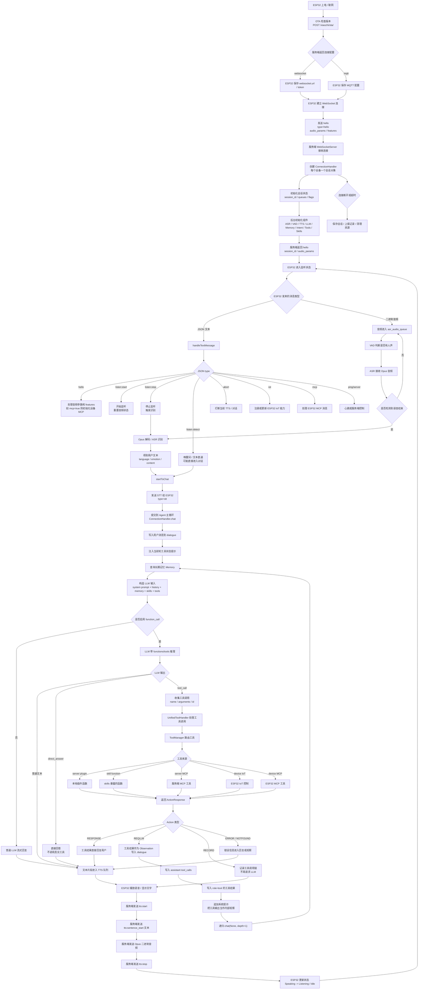
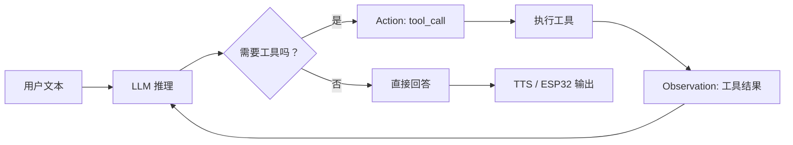

# Agent 工作流程

本文档用于说明当前系统中 Agent 的整体工作流程，以及 Agent 与 ESP32 之间的主要交互链路。

## 总体分层

```text
设备层：ESP32 负责音频采集、播放、OLED 显示、IoT/MCP 能力暴露

连接层：WebSocket 负责 JSON 控制消息 + Opus 二进制音频传输

Agent 层：ASR -> LLM/ReAct 工具循环 -> TTS -> ESP32 输出
```

## 完整流程图



## ReAct 工具循环

Agent 的核心推理结构接近 ReAct，但不是文本形式的 `Thought / Action / Observation`，而是基于 function calling 的结构化循环。



对应关系：

- Reason：LLM 根据 system prompt、history、memory、skills、functions 判断下一步。
- Action：LLM 输出结构化 tool call。
- Observation：工具结果以 `role=tool` 写回 dialogue。
- Final Answer：LLM 基于已有信息生成最终回复，进入 TTS 和 ESP32 输出链路。

## 关键代码入口

- 服务入口：`app.py`
- WebSocket 服务：`core/websocket_server.py`
- 单连接会话对象：`core/connection.py`
- 文本消息处理：`core/handle/textMessageProcessor.py`
- 音频接收与 ASR 触发：`core/handle/receiveAudioHandle.py`
- TTS 与音频发送：`core/handle/sendAudioHandle.py`
- 工具统一入口：`core/providers/tools/unified_tool_handler.py`
- 工具路由管理：`core/providers/tools/unified_tool_manager.py`
- skills 加载：`core/providers/skills/skill_loader.py`
- ESP32 WebSocket 协议：`C:\workspace\xiaozhi_benyl\main\protocols\websocket_protocol.cc`
- ESP32 JSON 分发：`C:\workspace\xiaozhi_benyl\main\application.cc`

## 一句话总结

ESP32 通过 WebSocket 向服务端发送 JSON 控制消息和 Opus 音频；服务端 Agent 完成 ASR、LLM 推理、工具调用和 TTS；最终再通过同一条连接把文字、音频、点阵图、IoT/MCP 命令推送回 ESP32。
